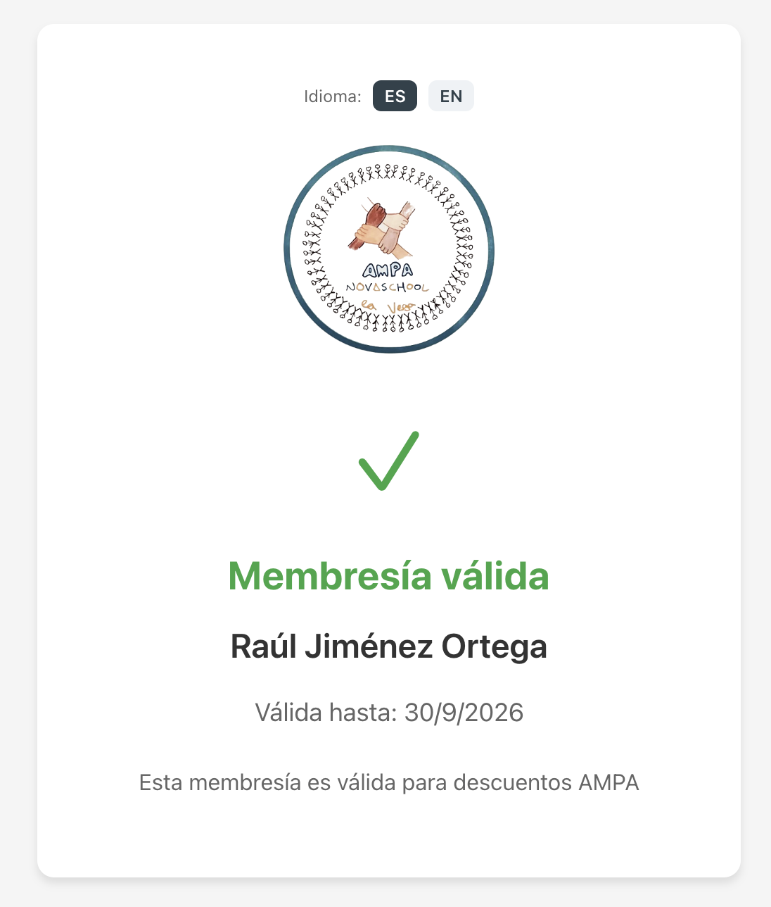
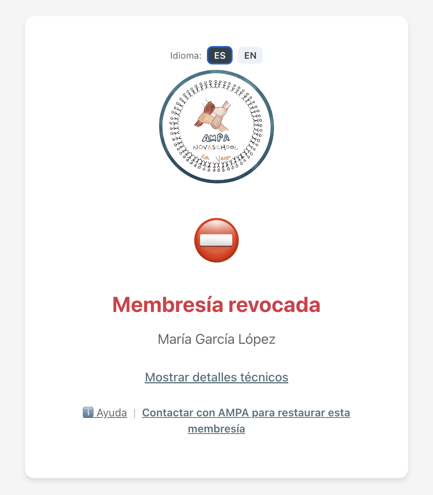

# Manual de Usuario - Verificador

## Para quién es esta guía

Esta guía es para empresas amigas del AMPA que necesitan verificar los carnets de personas asociadas al AMPA.

## Qué hace Verificador

Al escanear un QR, el verificador comprueba:

- La fecha validez del código QR
- La fecha de caducidad
- Que el código ha sido generado por el AMPA Novaschool Almería
- Y si la persona sigue siendo socia del AMPA o se le ha dado de baja por algún otro motivo

## Entender los estados

### Carnet en vigor

- Estado verde con nombre del socio
- Muestra fecha de validez
- Confirma que la persona sigue asociada en el AMPA

### Membresía revocada

- Dicha persona ya no forma parte del AMPA
- La tarjeta/socio no debe aceptarse
- Se incluye enlace de contacto para soporte

### Membresía no válida

Posibles motivos:

- Carnet caducado
- Código QR incorrecto

Puedes abrir `Mostrar detalles técnicos` para diagnóstico de soporte.
